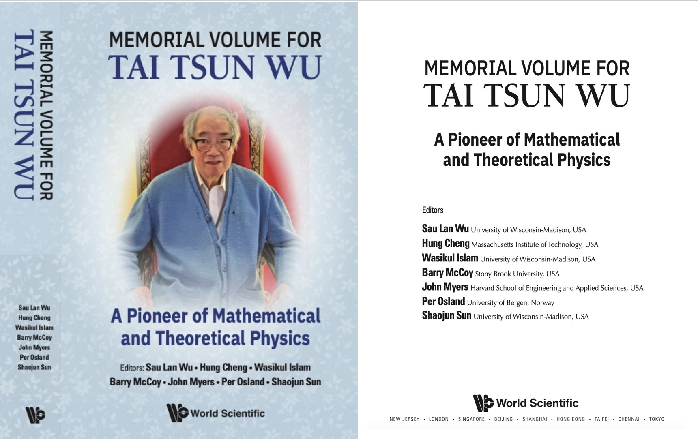
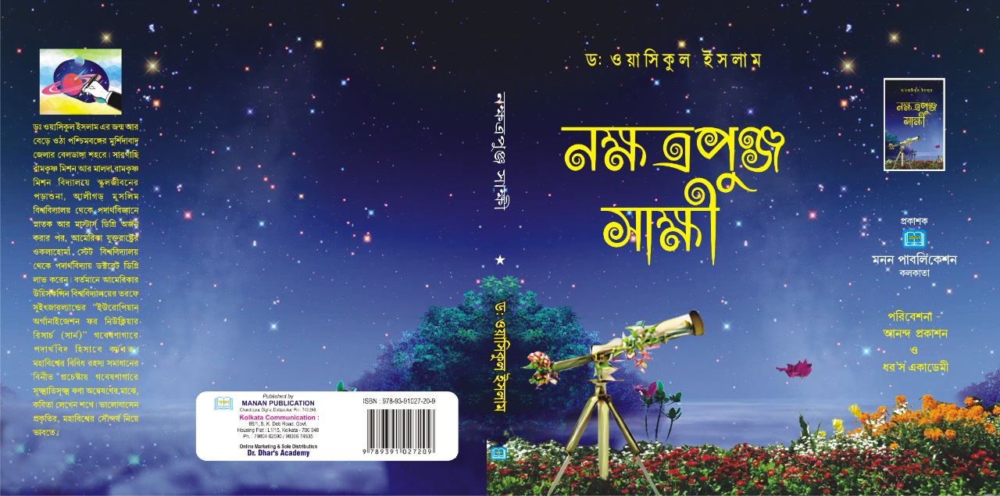
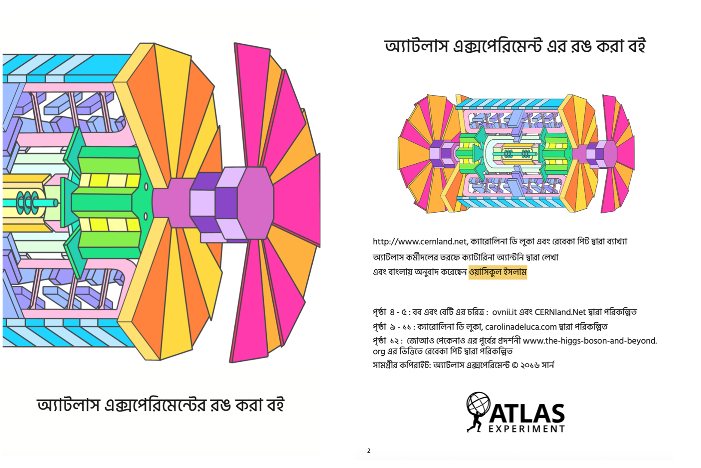

  

## Book 1: Memorial Volume for Tai Tsun Wu

- **Memorial Volume for Tai Tsun Wu: A Pioneer of Mathematical and Theoretical Physics**, World Scientific Publishing, ISBN: 978-981-98-2190-7. Editors: Prof. Sau Lan Wu (Wisconsin), Prof. Hung Cheng (MIT), Dr. Wasikul Islam (Wisconsin), Prof. Barry McCoy (Stony Brook), Dr. John Myers (Harvard), Prof. Per Osland (Bergen), and Shaojun Sun (Wisconsin).

The memorial volume honors the life and scientific contributions of Professor Tai Tsun Wu—longtime Professor of Physics at Harvard University and a distinguished theoretical physicist. Prof. Tai Tsun Wu made pioneering contributions to mathematical and theoretical physics, often in collaboration with Nobel Laureate C. N. Yang and other leading physicists. In addition to reprinting some of his celebrated research papers, our ~500-page book includes reprinting of recollections and commentaries by many prominent physicists, such as Nobel Laureate Sheldon Glashow (Harvard), Michael Peskin (SLAC/Stanford), Arthur Jaffe (Harvard), and some of Tai Tsun Wu's research collaborators.
The book is being distributed to major universities, laboratories, and libraries around the world by the publisher and is available on relevant book platforms such as Amazon and Barnes & Noble.
World Scientific webpage for book: [https://www.worldscientific.com/worldscibooks/10.1142/14546](https://www.worldscientific.com/worldscibooks/10.1142/14546))
Amazon link: [https://www.amazon.com/Memorial-Tai-Tsun.../dp/9819821908](https://www.amazon.com/Memorial-Tai-Tsun-Mathematical-Theoretical/dp/9819821908)

---
## Book 2: Nokkhatra Punja Sakkhi (Bangle poetry) by Dr. Wasikul Islam

- **“নক্ষত্রপুঞ্জ সাক্ষী” - ("Stars are the Witness" in Bangla)**, Manan Publication, India, ISBN: 978-93-91027-20-9.

A collection of 50 poems in the Bangla language, published in January 2023 in Kolkata, India. 

Amazon link: [https://www.amazon.in/Nokkhatra-Punja-Sakkhi-Wasikul-Islam/dp/B0DKTHN28C](https://www.amazon.in/Nokkhatra-Punja-Sakkhi-Wasikul-Islam/dp/B0DKTHN28C)

  

---

## Book Translation: ATLAS Experiment Colouring Book in Bengali by Katarina Anthony, translated by Wasikul Islam

Translated a popular science outreach book from ATLAS/CERN into the Bangla language. This happens to be the first CERN document/book in the Bangla language. CERN CDS reference: ATLAS-OUTREACH-2021-008. 

CERN document Link: [https://cds.cern.ch/record/2751049](https://cds.cern.ch/record/2751049/files/ATLAS%20Experiment%20Colouring%20Book%20in%20Bengali%20-%20A4.pdf)

  

